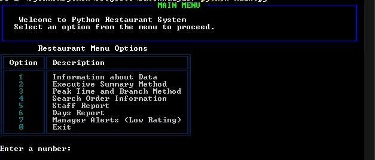
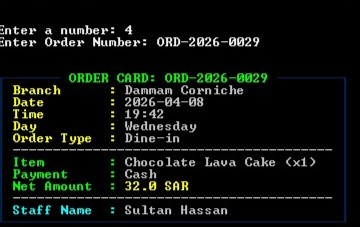
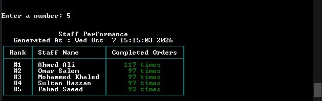

# Restaurant Data Analytics CLI 🍽️

A lightweight Python CLI tool built using `pandas` to crunch restaurant sales data and turn raw figures into clear, actionable insights.

It helps track sales revenue, find peak hours, monitor staff activity, and catch low customer ratings quickly.

## 📌 Features

* **Data Overview:** Quick summary of dataset size, columns, and data types.  


* **Order Lookup:** Instant search to fetch specific order details by Order ID.



* **Branch & Peak Hours:** Performance breakdown across branches, rush times, and best-selling items.


* **Executive Summary:** Overall revenue, order counts, average ticket size, and top payment methods.
* **Staff Performance:** Counts orders handled by each team member.
* **Days Analysis:** Highlights the busiest days of the week.
* **Manager Alerts:** Flags low-rated orders (< 3 stars) so management can follow up.

## ⚙️ How to Run

1. Make sure you have `pandas` installed:
   ```bash
   pip install pandas
   pip install rich
